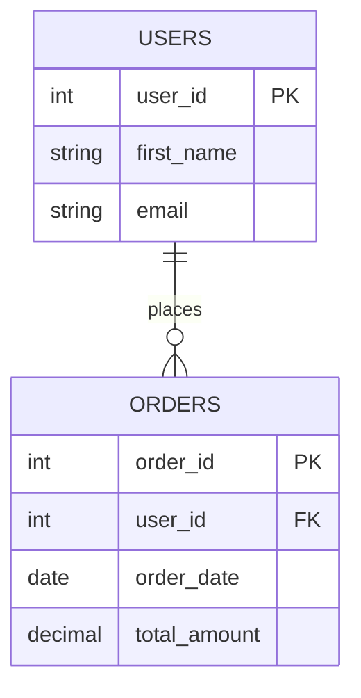

# 02. Database Design

Database design is the process of translating real-world business requirements into a structured, logical model that a Relational Database Management System (RDBMS) can manage efficiently.

Jumping straight into `CREATE TABLE` statements without design leads to predictable problems:

- Data redundancy
- Insert, update, and delete anomalies
- Slow queries
- Schemas that are hard to evolve

As an enterprise backend engineer, your first database tool is usually a whiteboard, not a SQL prompt.

---

## 1. The Database Design Process

A robust database design typically moves from abstract business needs to concrete implementation.

1. **Requirements Gathering**
   - Identify what must be stored and how the application will use it.
   - Example: track users, products, orders, and shipping addresses.

2. **Conceptual Design**
   - Identify core business entities and their relationships.
   - Usually represented as high-level diagrams.

3. **Logical Design**
   - Define attributes (columns), keys, and strict relationship mapping.
   - Output is typically an Entity-Relationship Diagram (ERD).

4. **Normalization**
   - Apply normalization rules to reduce redundancy and prevent anomalies.

5. **Physical Design**
   - Translate logical design into SQL for a specific engine (for example PostgreSQL).
   - Choose data types, constraints, indexes, and naming conventions.

---

## 2. Entities and Attributes

### Entities

An **entity** is a business-relevant object, person, concept, or event whose data must be stored.

- Rule of thumb: entities are usually nouns.
- Examples: User, Product, Order, Department, Employee, Invoice.
- Implementation mapping: entity -> table.

### Attributes

An **attribute** is a specific detail that describes an entity.

- Rule of thumb: attributes are descriptive details of the noun.
- Example attributes for `User`: first_name, last_name, email, date_of_birth, password_hash.
- Implementation mapping: attribute -> column.

---

## 3. The Power of Keys

Keys make relational data reliable and linkable.

### Primary Key (PK)

A **primary key** uniquely identifies each row in a table.

Rules for a primary key:

- Unique: no duplicate values
- Not null: must always have a value
- Ideally immutable: should rarely change

Examples:

- A generated `user_id` integer is usually ideal.
- An email can be unique, but it can change over time, so it is often better as a unique column rather than the primary key.

### Foreign Key (FK)

A **foreign key** in one table references a primary key in another table.

This creates relationships and enforces referential integrity.

Example:

- Instead of duplicating user details in `orders`, store `user_id` in `orders` and reference `users(user_id)`.

---

## 4. Entity-Relationship Diagrams (ERDs)

An ERD is the blueprint of your database. It visualizes:

- Entities
- Attributes
- Relationships

Engineers commonly use draw.io, Lucidchart, or dedicated database modeling tools.

### Example ERD: Users place Orders



How to read this:

- Each box is an entity (`USERS`, `ORDERS`).
- Entries inside boxes are attributes (columns).
- `PK` marks a primary key.
- `FK` marks a foreign key.
- The connector shows cardinality.
  - `USERS ||--o{ ORDERS` means one user can place zero or many orders.

---

## 5. Translating Design to SQL (Preview)

After logical design and normalization, translate the model to SQL.

```sql
-- Parent table first
CREATE TABLE users (
    user_id SERIAL PRIMARY KEY,
    first_name VARCHAR(50) NOT NULL,
    email VARCHAR(255) UNIQUE NOT NULL
);

-- Child table referencing parent
CREATE TABLE orders (
    order_id SERIAL PRIMARY KEY,
    user_id INTEGER NOT NULL,
    order_date DATE NOT NULL,
    total_amount DECIMAL(10, 2) NOT NULL,
    FOREIGN KEY (user_id) REFERENCES users(user_id)
);
```

---

## Up Next

You now understand the core building blocks of database design:

- Entities
- Attributes
- Primary keys
- Foreign keys

Next, move to `03-SQL-Basics.md` to learn Data Manipulation Language (DML):

- `SELECT`
- `INSERT`
- `UPDATE`
- `DELETE`
